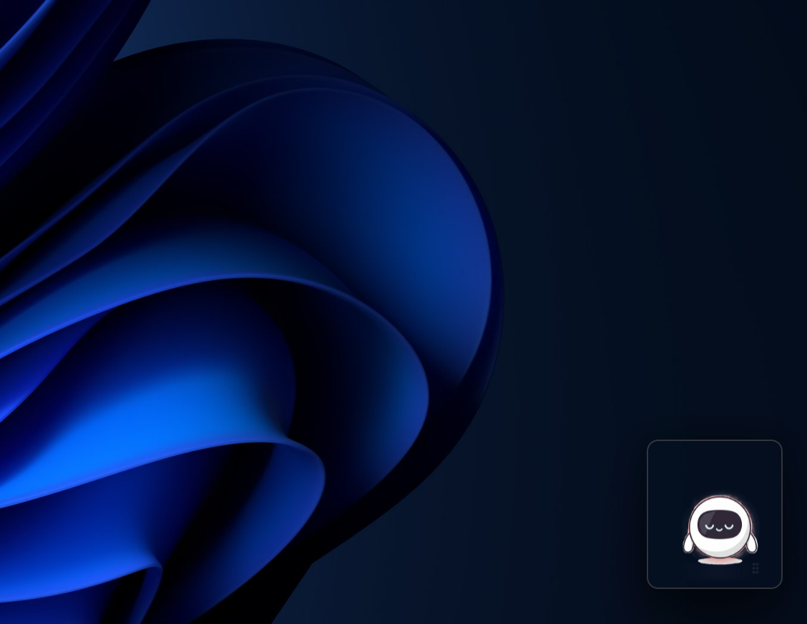
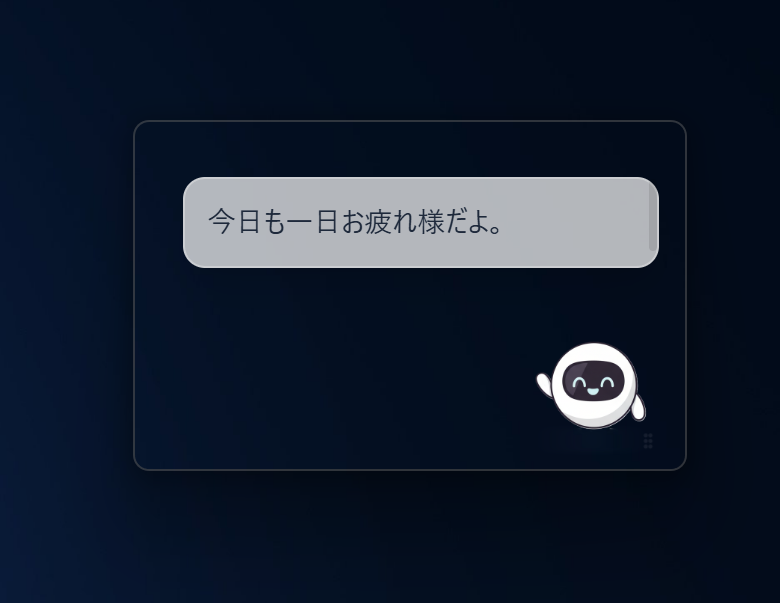
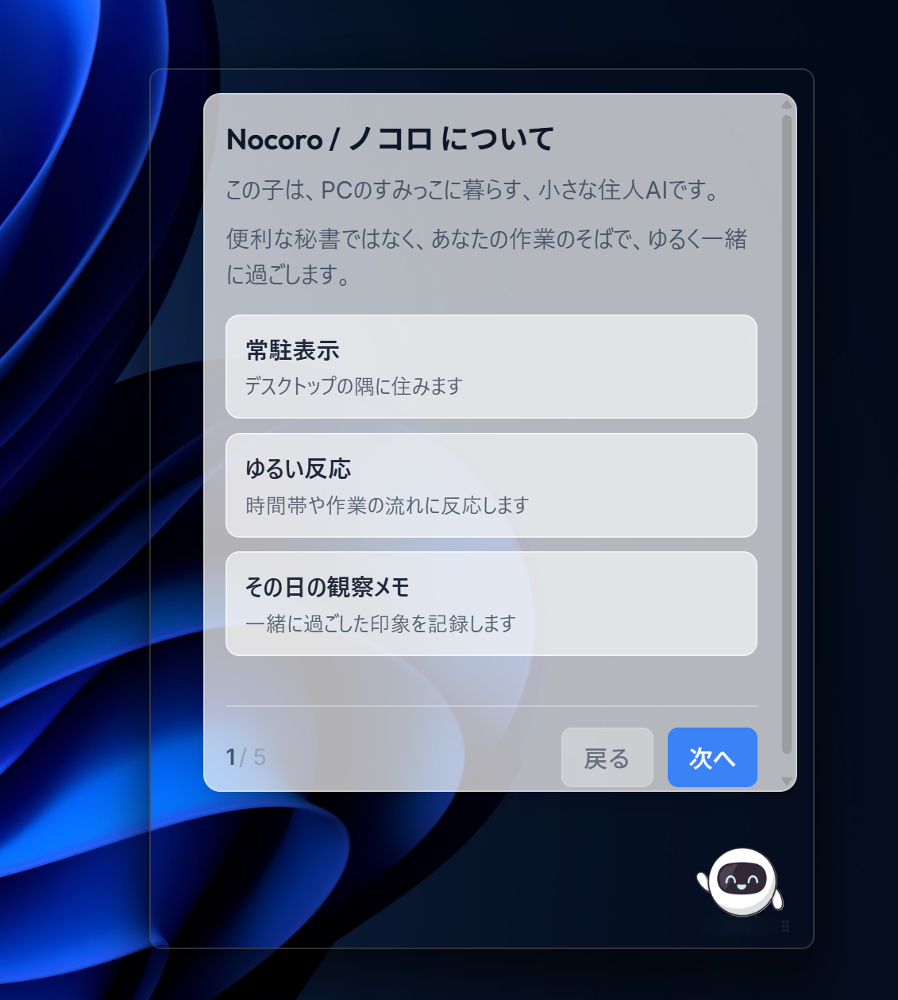
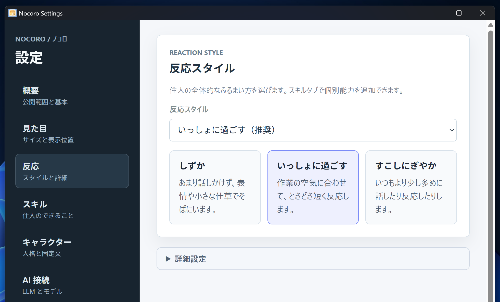
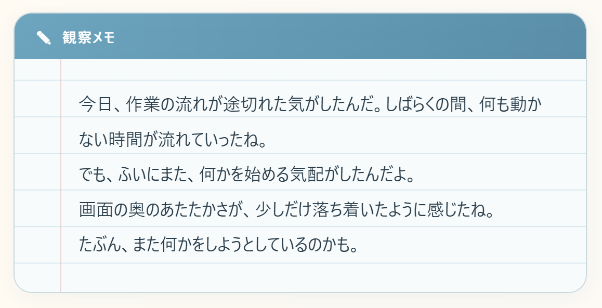
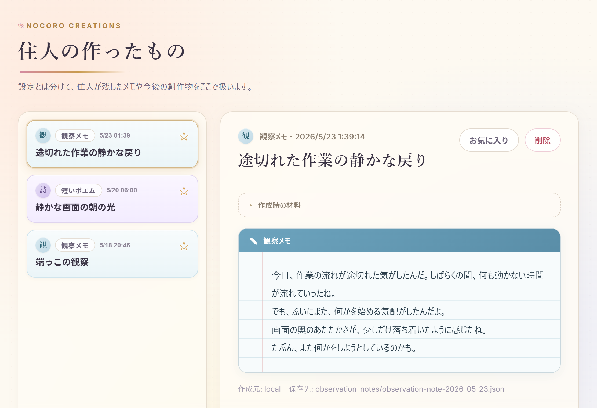

# Nocoro / ノコロ

PCの中で一緒に過ごす、小さな住人AI。

Nocoro は、デスクトップのすみで短く反応し、必要なときだけ画面を見てもらい、今日の観察メモを残せる常駐アプリです。プレビュー版として、まずは「そばにいる安心感」と「様子がわかること」を大事にしています。

> 現在は Windows 向けのプレビュー版です。仕様や保存形式は今後変更される可能性があります。

## できること

- デスクトップの隅に小さく常駐する
- 時間帯や作業の区切りに短く反応する
- 初回の案内と設定導線がある
- 反応モードを切り替えられる
- 今日の観察メモを確認できる
- 住人メモを後から読める
- 必要なときだけ画面を見てもらえる
- ローカル LLM が未接続でも、固定文による最低限の反応ができる

## スクリーンショット

| デスクトップ常駐 | 短い反応 |
|---|---|
|  |  |

| オンボーディング | 反応モード設定 |
|---|---|
|  |  |

| 今日の観察メモ | 住人メモ一覧 |
|---|---|
|  |  |

## ダウンロード

最新版は GitHub Releases から入手できます。Release ページの Assets から `Nocoro-Preview-v0.1.0` のインストーラーをダウンロードしてください。

## インストール

1. Releases からインストーラーをダウンロードします
2. インストーラーを実行します
3. 初回起動時の案内に従って設定します

詳細は [docs/install.md](docs/install.md) を確認してください。

## 安心して使うために

- 画面を常時監視しません
- 「今の画面を見てもらう」はユーザーが操作したときだけです
- 保存内容は確認して削除できます
- 勝手に既存ファイルを編集しません
- 外部通信が必要な機能は、必要な場面でのみ使います

詳細は [docs/privacy.md](docs/privacy.md) と [docs/safety.md](docs/safety.md) を確認してください。

## 既知の制限

- Windows向けのプレビュー版です
- 環境によっては起動時に警告が出る場合があります
- DPI設定やマルチモニタ環境で表示位置がずれることがあります
- 一部機能や表示は今後変わる可能性があります

詳細は [docs/known-issues.md](docs/known-issues.md) を確認してください。

## フィードバック

- [GitHub Issues](https://github.com/AIGameCreators/nocoro-public/issues)：不具合報告・改善要望
- [X](https://x.com/Code_fami)：Nocoroを含む個人開発の進捗
- [TikTok](https://www.tiktok.com/@gamescodefam)：Nocoroの紹介動画
